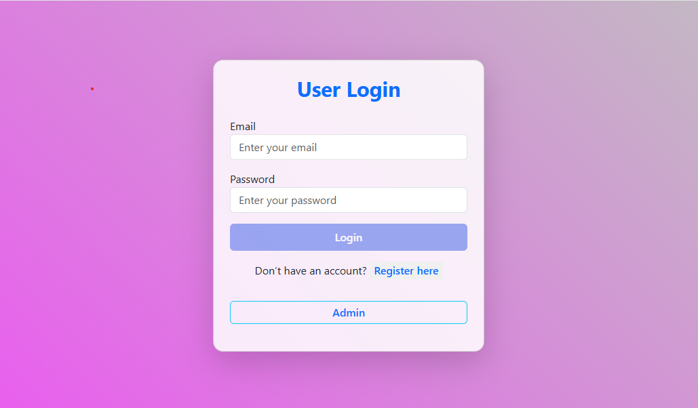
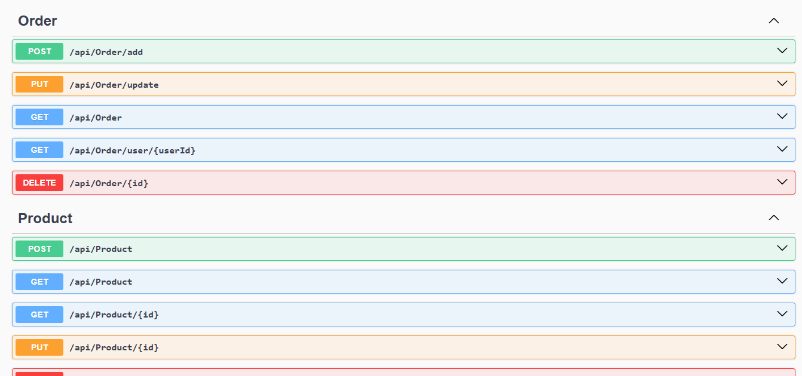

step 1 : (necessary download)

[Visual Studio Code](https://code.visualstudio.com/) — for frontend  
-[Visual Studio](https://visualstudio.microsoft.com/vs/) — for backend  
-  [SQL Server](https://www.microsoft.com/en-us/sql-server/sql-server-downloads)  
-  [SQL Server Management Studio (SSMS)](https://aka.ms/ssmsfullsetup)

step 2:
====start Angular==== 
1. Install Node.js

   Download and install from [https://nodejs.org](https://nodejs.org)

2. Install Angular CLI

 
   npm install -g @angular/cli

3. Open Project Directory in Visual Studio Code

   ```bash
   cd frontend/bringova
   ```

4. Run the Project

   ```bash
   ng serve --open
   ```

---

### 🖼️ Output



---

### 🔐 Admin Authentication

```
Username: admin@
Password: admin123
```

---


step 3:
---sql server setup

 Open SQL Server and complete installation.
2. Install SQL Server Management Studio (SSMS).
3. Connect SSMS with SQL Server using your server name.
4. Create database and tables using the SQL file provided in the `database` folder.

---


step 4:

===visual studio setup==

Download Visual Studio and install it with **ASP.NET Core** workload.

2. Open project directory:

   ```
   backend/bringova
   ```

3. Open `/appsettings.json` and replace `"YOUR_SERVER_NAME"` with your actual SQL Server name:

   ```json
   "ConnectionStrings": {
     "ShopDB": "Server=YOUR_SERVER_NAME;Database=ShopDB;Trusted_Connection=True;TrustServerCertificate=True;"
   }
   ```

4. Go to NuGet Package Manager and install:

   ```
   Microsoft.Data.SqlClient
   ```

5. In `Program.cs`, update the CORS origin URL to match your Angular app URL:

   ```csharp
   builder.Services.AddCors(options =>
   {
       options.AddPolicy("AllowOrigin",
           policy => policy.WithOrigins("http://localhost:4200")
                           .AllowAnyHeader()
                           .AllowAnyMethod());
   });
   ```

6. Run the project in Visual Studio.

---

###Project Ready


